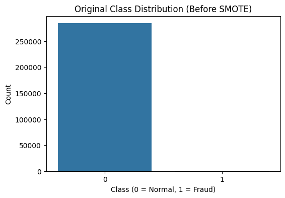
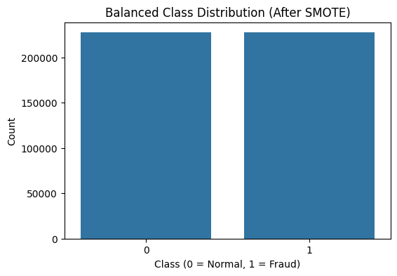
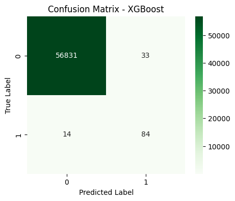
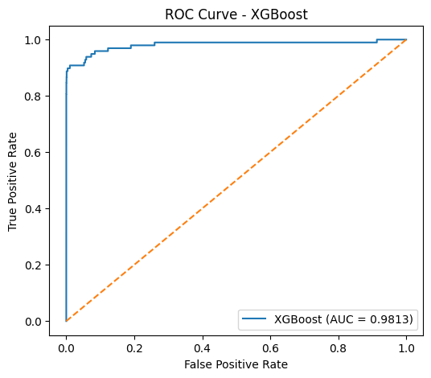

# AI Credit Card Fraud Detection

Machine Learning and Deep Learning based fraud detection system designed to identify fraudulent credit card transactions from a highly imbalanced financial dataset.

---

## 🚀 Project Overview

Credit card fraud detection is a critical challenge in modern financial systems due to the extremely imbalanced nature of transaction data.

This project builds an AI-based fraud detection system using multiple Machine Learning and Deep Learning models to detect fraudulent transactions and compare their performance.

Key focus areas:

* Handling severe class imbalance using **SMOTE**
* Comparing multiple Machine Learning models
* Evaluating models using robust performance metrics
* Fraud probability prediction system
* Simulation of real-world fraud prediction

---

## 🧠 Models Implemented

The following models were trained and evaluated:

* Logistic Regression (Baseline Model)
* Random Forest (Ensemble Learning)
* XGBoost (Gradient Boosting)
* Artificial Neural Network (Deep Learning)
* Autoencoder (Anomaly Detection)

These models were compared to determine the most effective approach for detecting fraudulent transactions.

---

## ⚙️ Tech Stack

* Python
* Pandas
* NumPy
* Scikit-learn
* TensorFlow / Keras
* Matplotlib
* Seaborn
* Imbalanced-learn (SMOTE)
* XGBoost

---

## 📊 Key Features

* Data preprocessing and feature scaling
* Handling imbalanced datasets using **SMOTE**
* Multiple Machine Learning and Deep Learning models
* Confusion Matrix and ROC-AUC evaluation
* Fraud probability prediction system
* Model performance comparison

---

## 📁 Dataset

The dataset is too large to host directly on GitHub.

Download the dataset using the link below:

https://drive.google.com/uc?export=download&id=186RAbl9rcAzzxapGRw9nwRei9nPaTuLP

After downloading, place the CSV file inside the project directory.

---

## 📂 Project Structure

AI-Credit-Card-Fraud-Detection
│
├── Credit_Card_Fraud_Detection.ipynb
├── requirements.txt
├── screenshots
│   ├── class_distribution_before_smote.png
│   ├── class_distribution_after_smote.png
│   ├── confusion_matrix_xgboost.png
│   └── roc_curve_xgboost.png
└── README.md

---

## 🧪 How to Run

1. Clone the repository

2. Install required libraries

pip install -r requirements.txt

3. Download the dataset using the provided link

4. Place the dataset CSV file inside the project folder

5. Open the notebook

Credit_Card_Fraud_Detection.ipynb

6. Run all cells to train and evaluate the models

---

## 📸 Project Screenshots

### Class Distribution Before SMOTE

### Class Distribution After SMOTE

### Confusion Matrix (XGBoost)

### ROC Curve (XGBoost)

---

## 📈 Results

The models achieved strong fraud detection performance despite the extreme class imbalance in the dataset.

Evaluation metrics used:

* Precision
* Recall
* F1 Score
* ROC-AUC

Ensemble models and deep learning approaches demonstrated strong capability in identifying fraudulent transactions.

---

## 🔮 Future Improvements

* Real-time fraud detection system
* API deployment using Flask or FastAPI
* Integration with financial transaction systems
* Live fraud monitoring dashboard
* Advanced anomaly detection models

---

## 👤 Author

**Dheeraj C**
AI & Machine Learning Developer
Interested in building real-world AI systems for financial security and data-driven applications.

---

⭐ If you found this project useful, consider giving it a star.
